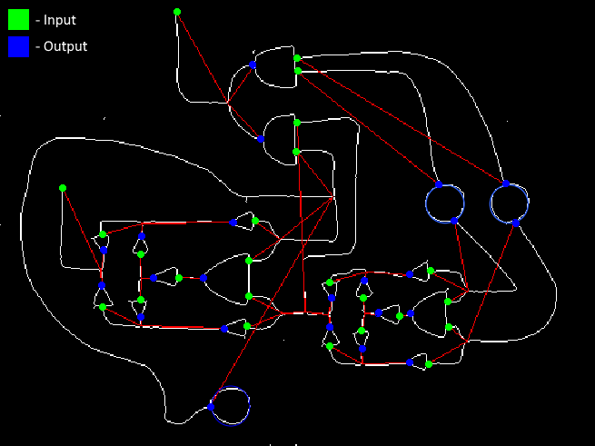

# Picture to Circuit
Image analysis project that converts a picture of a digital circuit containing and, or (in the form of junctions)
and not gates into a digital model of the circuit. Mostly for fun, but could be useful for students learning about digital logic!
Below is an image taken with a mobile camera (left) and the processed circuit graph (right) from which a logical circuit can be constructed.

  
&nbsp; &nbsp; &nbsp; &nbsp;
  

